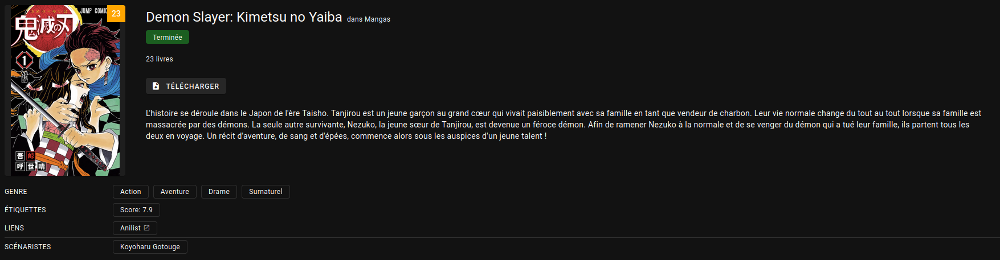

<p align="center">
  
  <a href="https://github.com/simon-verbois/Komga-Meta-Manager/commits/main"></a>
</p>

# Komga Meta Manager

An automated tool to enrich your Komga manga series metadata using the AniList API, featuring optional translation and persistent caching.

## ✨ Features

  * **Automated Metadata Fetching:** Automatically searches for and fetches **Title**, **Summary**, **Status**, **Genres**, and **Tags** for your Komga series from **AniList**.
  * **Targeted Processing:** Only processes libraries you specify in the configuration.
  * **Translation Support:** Seamlessly translates fetched metadata (like summaries, genres, and tags) into your preferred language using **Google Translate** or **DeepL**.
  * **Smart Updates:** Choose to only fill in empty metadata fields or overwrite existing ones.
  * **Persistent Caching:** Avoid repeated API calls and speed up processing with a persistent translation cache.
  * **Flexible Operation:** Run once manually or enable the built-in scheduler to run the process daily at a set time.
  * **Dry-Run Mode:** Test your configuration and see exactly what changes will be made before applying them to Komga.

## 📷 Example (Before/After)




## 🚀 Installation and Setup

The easiest way to run the Komga Meta Manager is using Docker.

### Prerequisites

1.  A running instance of **Komga**.
2.  A Komga **API Key** (recommended to create a specific read/write user for this tool).
3.  **Docker** and **Docker Compose** installed on your system.

### 1\. Configure the Project

The application is configured using a single YAML file named `config.yml`. It is crucial to set your Komga server details and desired processing logic in this file.

1.  Create a directory for your Komga Meta Manager setup (e.g., `komga-meta-manager`).
2.  Inside this directory, create a subdirectory named `config`.
3.  Create the main configuration file, `config/config.yml`, by starting with the example below:
4.  *(Optional but recommended)* You can also create a file named `config/translations.yml` to define manual translations for specific genres or tags, which overrides the automatic translator.

**`config/config.yml`**

```yaml
# ================================================================= #
#             Komga Meta Manager Configuration File                 #
# ================================================================= #

system:
  dry_run: true
  debug: false
  scheduler:
    enabled: false
    run_at: "04:00"
    
komga:
  url: "YOUR_KOMGA_URL" 
  api_key: "YOUR_API_KEY" 
  libraries:
    - "Mangas"
    - "Manhwa"
  verify_ssl: true

provider:
  name: "anilist"

processing:
  overwrite_existing: true

translation:
  enabled: true
  provider: "google"
  target_language: "fr"
```

#### Configuration Parameters Explained

The table below explains every parameter in the `config.yml` file.

| Section | Parameter | Type | Default | Description |
| :--- | :--- | :--- | :--- | :--- |
| **`system`** | **`dry_run`** | Boolean | `false` | If **`true`**, the script runs without making **any changes** to Komga; it only logs proposed updates. |
| | **`debug`** | Boolean | `false` | Enables verbose logging (DEBUG level) for troubleshooting. |
| | **`scheduler.enabled`** | Boolean | `true` | If **`true`**, the job runs daily at the specified time. If **`false`**, it runs once and the container exits. |
| | **`scheduler.run_at`** | String | `"04:00"` | The time of day to run the job, in **HH:MM** (24-hour) format. Only used if `scheduler.enabled: true`. |
| **`komga`** | **`url`** | String | *Required* | The full URL of your Komga instance (e.g., `https://komga.example.com`). |
| | **`api_key`** | String | *Required* | Your **Komga API Key**. |
| | **`libraries`** | List of Strings | *Required* | A list of the **exact names** of the Komga libraries you want to process. |
| | **`verify_ssl`** | Boolean | `true` | If set to `false`, disables SSL certificate verification (useful for self-signed certificates, but less secure). |
| **`provider`** | **`name`** | String | `"anilist"` | The metadata source to use. Currently, only **`anilist`** is supported. |
| **`processing`** | **`overwrite_existing`** | Boolean | `false` | If **`true`**, fetched metadata will **overwrite** any existing Komga metadata. If **`false`**, it only fills in fields that are currently empty or unlocked. |
| | **`force_unlock`** | Boolean | `false` | If **`true`**, the script will automatically **unlock** any locked metadata fields in Komga before updating them. This allows for a complete refresh of metadata. |
| **`translation`** | **`enabled`** | Boolean | `true` | If **`true`**, metadata (summary, genres, tags) will be translated into the `target_language`. |
| | **`provider`** | String | `"google"` | The translation service to use. Supported: **`google`**, **`deepl`**. |
| | **`deepl.api_key`** | String | *Required if provider is `deepl`* | Your **DeepL API Key**. |
| | **`target_language`** | String | `"fr"` | The ISO 639-1 code for the language you want to translate to (e.g., `fr`, `en`, `es`). |


### 2\. Run with Docker Compose

1.  In the root directory of your project (the one containing the `config` folder), create the `docker-compose.yml` file:

**`docker-compose.yml`**

```yaml
services:
  komga-meta-manager:
    image: simonverbois/komga-meta-manager
    container_name: komga-meta-manager
    restart: unless-stopped
    environment:
      # Set your timezone
      - TZ=Europe/Brussels 
    volumes:
      # Mount the configuration folder where the app will look for config.yml and cache files
      - ./config:/config
```

2.  Run the container:

<!-- end list -->

```bash
docker-compose up -d
```

3.  You can optionnaly run it with docker cli

```bash
docker run --rm -v "$(pwd)/config:/config" -e "TZ=Europe/Brussels" simonverbois/komga-meta-manager
```

### 3\. Verification

Check the logs to ensure the application is running correctly and connecting to Komga:

```bash
docker logs komga-meta-manager -f
```

## ⚙️ Resources

[Dockerhub Repository](https://hub.docker.com/r/simonverbois/komga-meta-manager)

[Komga Homepage](https://komga.org/)
