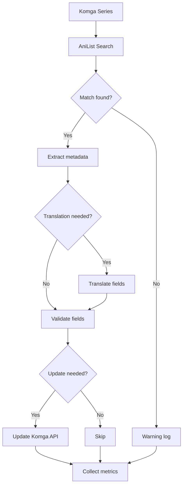

# Architecture - Komga Meta Manager

## 🏛️ Overview

Komga Meta Manager is a modular Python application designed to automatically enrich manga metadata in Komga. The architecture follows SOLID principles with clear separation of responsibilities.

## 📦 Modular Structure

```
modules/
├── constants.py          # Global constants (timeouts, paths, etc.)
├── config.py             # Configuration and validation with Pydantic
├── main.py               # Entry point and orchestration
├── metrics.py            # Performance metrics collection
├── models.py             # Pydantic data models (Komga, AniList)
├── komga_client.py       # HTTP client for Komga API
├── processor.py          # Main business logic
├── providers/            # External metadata providers
│   ├── base.py          # Common interface (Strategy Pattern)
│   ├── anilist_provider.py  # AniList implementation
│   └── # Other providers (MyAnimeList, etc.)
├── translators/          # Translation services
│   ├── base.py          # Common interface
│   ├── google_translator.py  # Google Translate implementation
│   └── deepl_translator.py   # DeepL implementation
└── utils.py              # Shared utilities
```

## 🏗️ Architectural Patterns

### 1. Strategy Pattern - Providers

```python
# Common interface
class MetadataProvider(ABC):
    def search(self, title: str) -> List[AniListMedia]:
        """Search for manga by title."""
        pass

    def save_cache(self):
        """Save cache."""
        pass

# Specific implementations
class AnilistProvider(MetadataProvider):
    def search(self, title: str) -> List[AniListMedia]:
        # AniList implementation
        pass

# Polymorphic usage
def create_provider(name: str) -> MetadataProvider:
    if name == "anilist":
        return AnilistProvider(...)
```

### 2. Strategy Pattern - Translators

```python
class Translator(ABC):
    def translate(self, text: str, target_lang: str) -> str:
        pass

def get_translator(name: str) -> Translator:
    if name == "google":
        return GoogleTranslator()
    elif name == "deepl":
        return DeepLTranslator(...)
```

### 3. Template Method Pattern - Processing

The `Processor` class defines a template for series processing:

```python
class Processor:
    def process_series_batch(self, config):
        # 1. Fetch series
        series = self._fetch_series()
        # 2. Process each series
        for serie in series:
            self._process_single_serie(serie)
        # 3. Generate report
        self._generate_report()
```

### 4. Observer Pattern - Metrics

```python
class ProcessingMetrics:
    def add_api_call(self, component, success):
        # Notify observers
        self.api_call_observers.notify(component, success)

    def add_error(self, error_type, message):
        # Log and record metrics
        logger.error(message)
        self.errors.append(...)
```

## 🔄 Data Flow

### Series Processing



### Multi-level Caching

1. **RAM Cache**: In-memory cache for current session
2. **Disk Cache**: Persistence between sessions
3. **Manual Overrides**: Priority manual translations

```python
def translate_with_cache(text, target_lang):
    # 1. Manual first (highest priority)
    if text in manual_translations[target_lang]:
        return manual_translations[target_lang][text]

    # 2. RAM cache
    if text in ram_cache:
        return ram_cache[text]

    # 3. Disk cache/API call
    if text in disk_cache:
        return disk_cache[text]

    # 4. API + add to cache
    result = api_translate(text, target_lang)
    ram_cache[text] = result
    # Periodic autosave
    return result
```

## 🛡️ Error Handling

### Retry Logic

```python
def _make_request_with_retry(self, method, url, max_retries=3):
    for attempt in range(max_retries):
        try:
            return self._make_request(method, url)
        except TimeoutError:
            if attempt < max_retries - 1:
                sleep(exponential_backoff(attempt))
            else:
                raise
        except HTTPError as e:
            if e.status_code >= 500:  # Retry on server errors
                continue
            else:  # Don't retry client errors
                raise
```

### Resilience Patterns

1. **Circuit Breaker**: Implemented - prevents cascading failures by monitoring API health
   - **Three States**: CLOSED (normal), OPEN (blocking), HALF_OPEN (testing recovery)
   - **Technical Defaults**: Pre-configured thresholds in constants.py for optimal resilience
   - **Thread-Safe**: Supports concurrent requests
   - **Metrics Integration**: Tracks state transitions and failure patterns
2. **Timeout Configuration**: Centralized timeout configuration
3. **Fallbacks**: Use default translations if API fails
4. **Robust Validation**: Pydantic models to validate external data

## 📊 Metrics and Observability

### Collected Metrics

```python
@dataclass
class ProcessingMetrics:
    # Session
    session_duration: float
    series_processed: int

    # Performance
    api_calls: Dict[str, int]  # {"komga": 150, "anilist": 80}
    cache_hit_ratio: Dict[str, float]
    avg_processing_time: float

    # Quality
    errors: List[ErrorDetails]
    success_rate: float

    # Metadata
    updates_applied: Dict[str, int]  # {"summary": 45, "genres": 23}
```

### Structured Logging

```python
# Logging configuration
logging.config.dictConfig({
    'version': 1,
    'formatters': {
        'detailed': {
            'format': '%(asctime)s - %(name)s - %(levelname)s - [%(filename)s:%(lineno)d] - %(message)s'
        }
    },
    'handlers': {
        'file': {
            'class': 'logging.FileHandler',
            'filename': 'app.log',
            'formatter': 'detailed'
        }
    },
    'loggers': {
        'modules': {
            'level': 'INFO',
            'handlers': ['file']
        }
    }
})
```

## 🚀 Scalability

### Adding a New Provider

1. Create a new class implementing `MetadataProvider`
2. Register in the `get_provider()` factory
3. Add corresponding configuration in `config.py`
4. Write unit tests

### Supporting a New Translation API

1. Implement translator in `translators/`
2. Add to `get_translator()` factory
3. Extend configuration model
4. Test with edge cases

### Horizontal Scaling

For processing large volumes:

1. **File-based queue**: Store tasks in files
2. **Worker pools**: Process in parallel with multiprocessing
3. **Database**: Replace file cache with database
4. **Async I/O**: Use asyncio for massive API calls

## 🔒 Security

### Secret Management

```python
# Environment variables for API keys
komga_api_key = os.getenv('KOMGA_API_KEY')
deepl_api_key = os.getenv('DEEPL_API_KEY')

# URL validation
class KomgaConfig(BaseModel):
    url: HttpUrl  # Automatically validates URLs
    verify_ssl: bool = True
```

### Input Validation

- **Pydantic models** for all configurations
- **Type hints** throughout the code
- **HTML sanitization** from AniList
- **Rate limiting** respected client-side

## 🧪 Testing Strategy

### Test Levels

1. **Unit Tests**: Isolated classes and functions
2. **Integration Tests**: Component integration
3. **End-to-End Tests**: Complete flows (with mocks)

### Coverage Goals

- **Unit tests**: 80%+ coverage
- **Integration**: Critical path coverage
- **E2E**: Main user scenarios

### Test Architecture

```python
# Shared fixtures
@pytest.fixture
def mock_anilist_api():
    with responses.RequestsMock() as rsps:
        rsps.add(responses.GET, 'https://graphql.anilist.co',
                 json=mock_anilist_response, status=200)
        yield rsps

# Parametrization
@pytest.mark.parametrize("status_code,expected_result", [
    (200, True),
    (404, False),
    (500, False),
])
def test_api_error_handling(status_code, expected_result):
    # Test various error conditions
    pass
```

## 📈 Performance

### Current Optimizations

1. **Connection pooling**: Reused requests sessions
2. **Multi-level caching**: RAM + Disk + Manual
3. **Lazy loading**: Data loaded on demand
4. **Batching**: Komga pagination respected

### Target Benchmarks

- **Series processing**: < 5 seconds
- **Cache hit ratio**: > 70%
- **Memory usage**: < 200MB for 10k series
- **API timeout**: < 30 seconds

### Monitoring

```python
# Integrated metrics
metrics = ProcessingMetrics()

@timer
def process_series(series):
    start_time = time.time()
    result = _process_series_impl(series)
    metrics.add_series_processed(series.name, result.success,
                               time.time() - start_time)
    return result
```

## 🔄 Migration and Compatibility

### Versioning

- **Semantic versioning**: MAJOR.MINOR.PATCH
- **Backward compatibility**: Maintained for configurations
- **Deprecation warnings**: For obsolete features

### Data Migrations

```python
def migrate_cache_format(old_version, new_version):
    """Migrate cache from old to new format."""
    if old_version < "1.1.0":
        # Migration logic for cache format changes
        pass
```

This architecture ensures Komga Meta Manager remains maintainable, extensible, and performant for large-scale metadata operations.
